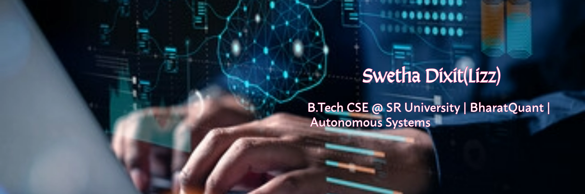

  

# 👋 Hello! I'm Swetha Dixit (Lizz)

### 🚀 Student B.Tech Artificial Intelligence & Machine Learning @ SR University | Future AI Engineer
AI/ML Expert with a passion for creating autonomous systems and data-driven products. Presently part of the **Dean's List** and **Semester Topper**.

---

### 💻 Technical Skill Set
* **Languages:** Java (Amigoscode), Python, SQL, C, HTML/CSS, JavaScript.
* **AI/ML:** Machine Learning, Generative AI (YOLOv8, ROS 2, NVIDIA Jetson).
* **Web Dev:** React, Node.js, Express.js, MongoDB (MERN Stack).
* **Others:** AWS (Academy Graduate), Git/GitHub, Microsoft Azure (AI-900).

---

### 🔨 Featured Work

#### 🥰 **Autonomous S&R Triage System**
* Designed a fully autonomous Search and Rescue drone system using **YOLOv8** and **ROS 2** for navigating in rescue operations.
* Deployed on **NVIDIA Jetson** for triage in disaster areas.

#### 💸 **BharatQuant**
* Working on a multi-modal AI system that predicts regime switches in the Indian stock market.

---

### ✅ Certifications & Memberships
* **Academic Success:** 2nd Year Best Academic Performance & Dean's List Recipient.
* **Active Role Model:** Active member of the **Cyber Security Club** at SR University.
* **Professional Achievement:** Microsoft Certified: Azure AI Fundamentals (AI-900).

---

### 📈 My Progress

---

### 🇩🇪 Goal: AI Internship in Germany (2027)
Currently focusing on learning **MLOps** and German Language (Goethe A2) for contributing to the German tech landscape.

名片
📫 **Get in Touch:** https://x.com/Swethadixit07/photo | [Email]swethadixit8@gmail.com
